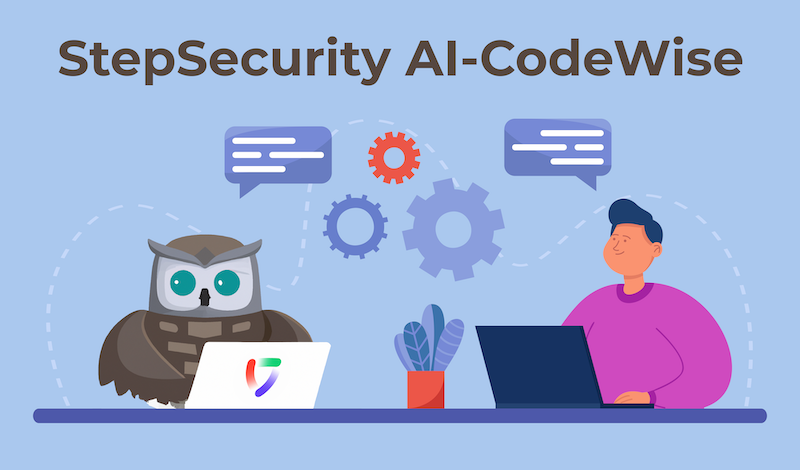
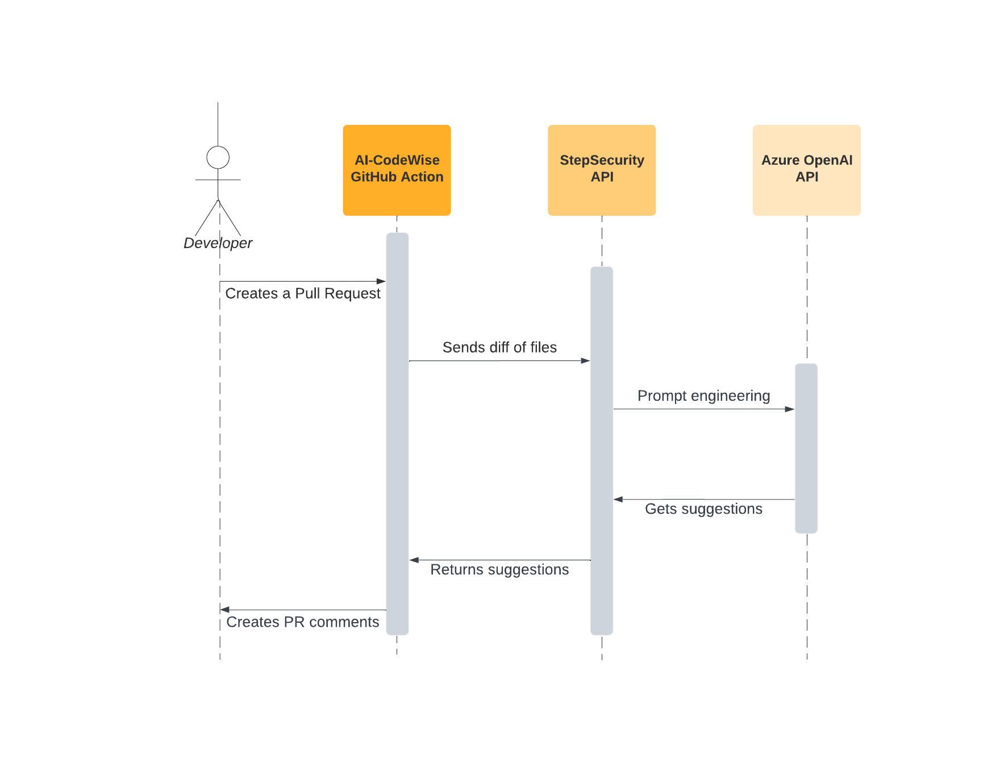
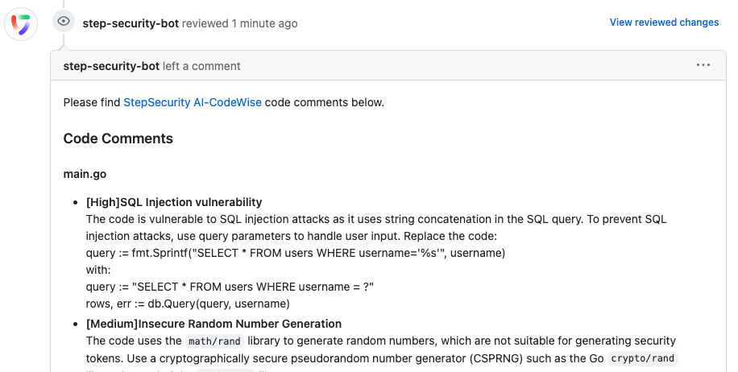

# AI-CodeWise

<p align="center">
  
</p>

<div align="center">

[](https://stepsecurity.io/?utm_source=github&utm_medium=organic_oss&utm_campaign=ai-codewise)
[](https://raw.githubusercontent.com/step-security/ai-codewise/main/LICENSE)

</div>

<p align="center">
🦉 AI-Powered Code Reviews for Best Practices & Security Issues Across Languages
</p>

---

AI-CodeWise GitHub Action: Your AI-powered Code Reviewer!

- 🧠 Triggers on pull requests, sending code diffs to StepSecurity API & using Azure OpenAI API for code analysis

- 🔒 Pull request comments via StepSecurity bot, pinpointing issues to enhance code quality & tackle security risks

<p align="center">
  
</p>

## Usage

To use AI-CodeWise, add this GitHub Actions workflow to your repositories

```yaml
name: Code Review
on:
  pull_request:
permissions:
  contents: read
jobs:
  code-review:
    runs-on: ubuntu-latest
    permissions:
      contents: read
      pull-requests: read
    steps:
      - name: Harden Runner
        uses: step-security/harden-runner@128a63446a954579617e875aaab7d2978154e969 # v2.4.0
        with:
          disable-sudo: true
          egress-policy: block
          allowed-endpoints: >
            api.github.com:443

      - name: Code Review
        uses: step-security/ai-codewise@v1
```

When you create a pull request in the repository, the workflow will get triggered and add a pull request comment. The comment will be added even if the pull request is from a fork. Here is an screenshot of what the comment will look like:

<p align="center">

</p>

## Comparison with existing SAST and IaC scanners

🌟 AI-CodeWise: Outshining rule-based scanners with:

1. All-in-One Review 🌐: Detects code smells, best practice violations, & security issues across languages for versatile code review.

2. Unforeseen Issue Detection 🎯: AI-powered for discovering issues that rule-based systems might miss, ensuring thorough code analysis.

3. Fix Suggestions 🔧: Offers code change suggestions directly in PR comments, empowering devs to resolve issues efficiently, boosting code quality & security.

## Examples

Here are a few example pull requests with PR comments from AI-CodeWise

1. [Terraform file](https://github.com/step-security/ai-codewise-demo/pull/2) with multiple security issues
2. [Java code](https://github.com/step-security/ai-codewise-demo/pull/5) vulnerable to XML external entities attacks
3. [JavaScript code](https://github.com/step-security/ai-codewise-demo/pull/3) vulnerable to open redirect
4. [Python code](https://github.com/step-security/ai-codewise-demo/pull/4) vulnerable to server-side request forgery (SSRF)
5. [C# code](https://github.com/step-security/ai-codewise-demo/pull/1) vulnerable to command injection

## Support for private repositories

To use AI-CodeWise on a private repository, please [join the beta](https://www.stepsecurity.io/contact).

## Limitations

- AI-CodeWise will only review changes if the total number of file changes in a pull request is less than 10.
- AI-CodeWise will only review changes in a file if the total characters in the diff is less than approximately 10K.

